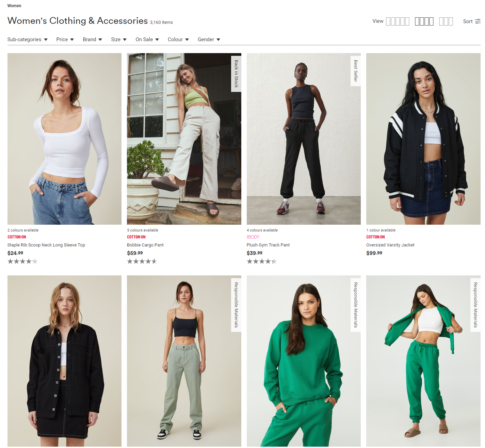
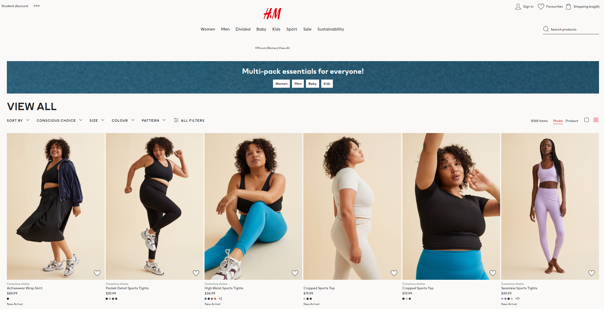
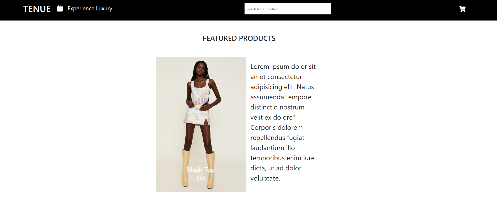
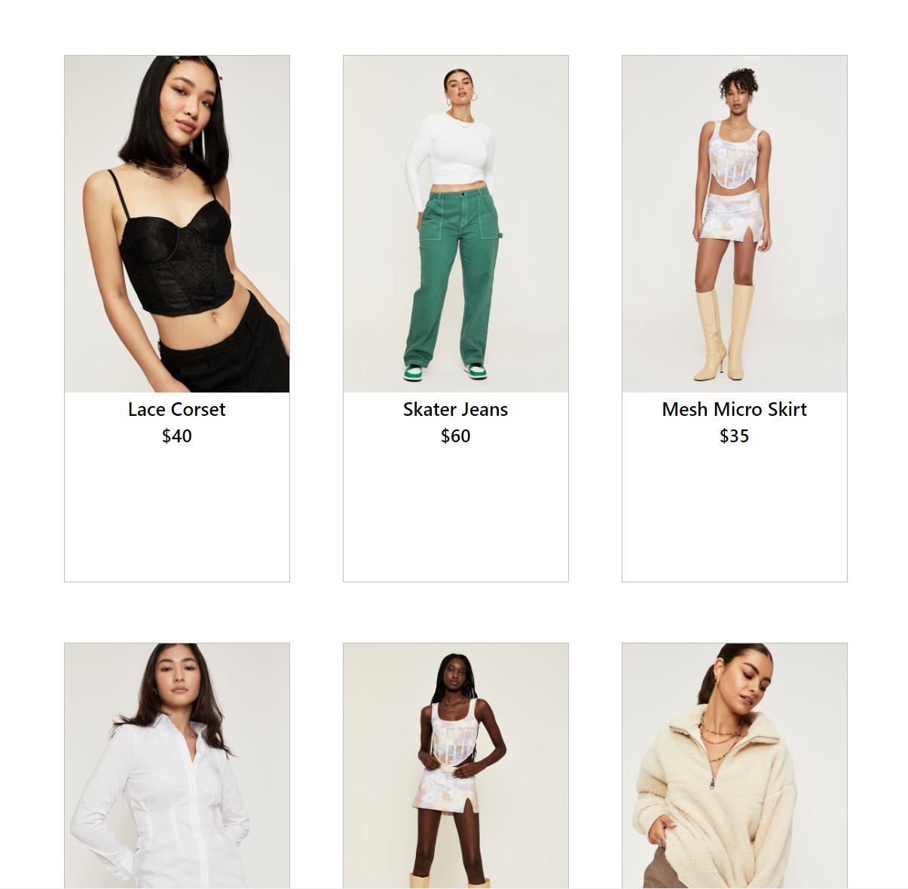
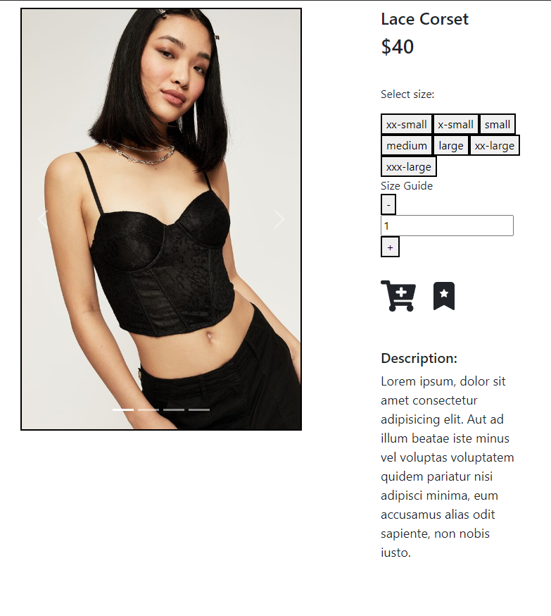
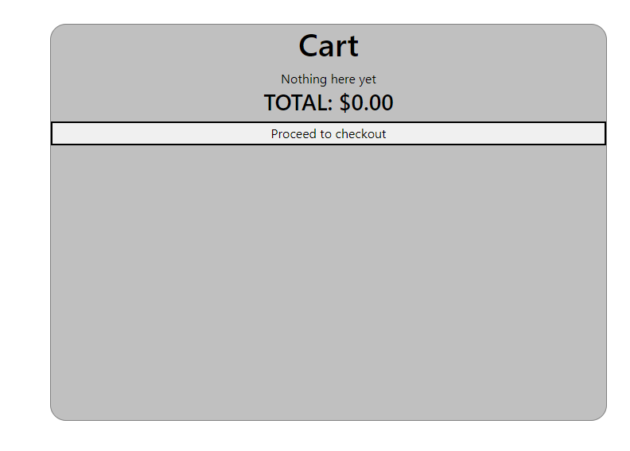

# React e-Shop Website

## Outline

This project is designed to reinforce your React learnings and make sure that you are comfortable with most aspect of the framework. With this project you will practice how to:

- Fetch Data within a React App
- Use react-router-dom
- Use Firebase/Firestore

# MVP

At a minimum your e-shop website should have two pages:

Home Page

This will contain:

- A Grid of products
- Carousel of featured products
- Product Page (with id parameter) Similar to a product page on another site, allows you to add to cart and select product variants

All products should be stored in Firestore:
You should store the following information:

- quantity
- variants (could be colors, sizes, etc)
- price per unit
- name
- image url
- favourited or not (boolean)

All data should be stored in Firestore and fetched by the frontend, there should be NO static product data in the react application

Create a cart system - Create a cart page in your react app. Add logic to prevent users from adding items to cart that are no longer in stock. You will have to check the current cart and the product quantity Cart page should have the following:

- List of products in cart
- Ability to change quantity of products in cart
- Ability to remove items from cart

TIPS :

- Make sure your site is scoped to one category of products

## Design Process

### Inspo

I noticed that, in terms of colour palette, most fashion websites stick to a simple colour palette, so I chose to stick with just black and white to add a look of minimalistic luxury.

Instead of a static image as the image that greets the user, I implemented a carousel, as in line with the MVP.

Originally, I did decide to use an API for the fake products but the images didn't really line up with my vision for the website so I instead decided to manually write my own products. These were then uploaded to my firebase database and dynamically called from there.

## Final Product

### Known Issues

- Carousel goes over the top of header when scrolling down on main page (Future fix).
- Cart data will be lost upon refresh

### Future Additions

- Checkout page
